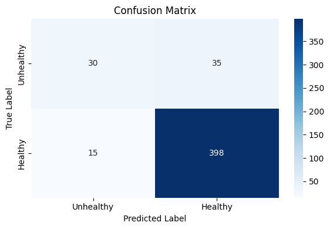
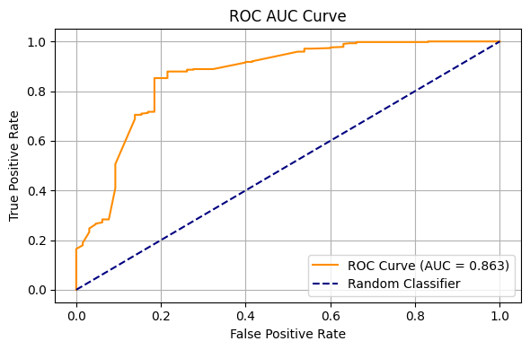

# Colony Health Assessment – Stacked ML Classifier

**Predict honeybee colony health (Healthy vs Unhealthy) using a stacked machine learning pipeline combining Decision Trees, AdaBoost, KNN, and MLP.**

---

## Project Overview

Honeybee colonies are vital pollinators but are affected by weather, food, space, and stressors.  
This project predicts hive health by combining multiple machine learning models in a **stacked ensemble**, leveraging the strengths of diverse classifiers for higher accuracy.

---

## Dataset

- Public dataset sourced from **Kaggle**  
[Dataset Link
](https://www.kaggle.com/datasets/jocelyndumlao/predicting-honeybee-health-from-hive-and-weather)

- Includes hive inspections, apiary metadata, and weather observations  
- Target variable: **Colony Health Status (Healthy / Unhealthy)**  

---

## Modeling Approach

- **Stacked ML Pipeline:** Combines multiple base learners for robust predictions  
- **Data Preprocessing:** Merged datasets, handled missing values, scaled numeric features, encoded categorical features  
- **Evaluation:** Confusion matrix, ROC curve, and classification metrics  

### Base Learners

1. **Decision Tree** – interpretable rule-based model  
2. **AdaBoost** – focuses on correcting misclassified samples  
3. **K-Nearest Neighbors (KNN)** – classifies based on similarity  

### Meta-Learner

4. **Multi-Layer Perceptron (MLP)** – neural network trained on base predictions for final output  

---

## Key Metrics

| Metric       | Value  |
|-------------|--------|
| Accuracy    | 89.5%  |
| F1 Score    | 94.1%  |
| Top Features| Weather, Brood, Queen, Food, Stressors, Space |

---

## Key Insights

- Hive health is influenced by **internal factors** (colony conditions) and **external factors** (weather, location)  
- Critical features like **brood, queen, food, and stressors** dominate predictions  
- Stacking multiple models significantly **improves performance** over individual classifiers  

---

##  Visualizations

- Confusion matrix showing true vs predicted labels  

- ROC AUC curve to evaluate model discrimination power  

---

## Tech Stack

- Python | Pandas | NumPy  
- scikit-learn | Matplotlib | Seaborn  
- Jupyter Notebook / VS Code  

